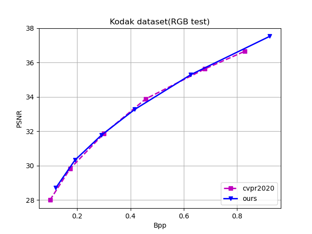

# PyTorch-Learned-Image-Compression-with-GMM-and-Attention

English | [简体中文](README_zh-CN.md)

This repo is implementation for [Learned Image Compression with Discretized Gaussian Mixture Likelihoods and Attention Modules](https://openaccess.thecvf.com/content_CVPR_2020/papers/Cheng_Learned_Image_Compression_With_Discretized_Gaussian_Mixture_Likelihoods_and_Attention_CVPR_2020_paper.pdf) in **pytorch**.

And the offical code written by **Tensorflow** is [here](https://github.com/ZhengxueCheng/Learned-Image-Compression-with-GMM-and-Attention).

## Install

The latest codes are tested on Ubuntu16.04LTS, CUDA10.1, PyTorch1.2 and Python 3.7

You should install the libraries of this repo.

```sh
pip install -r requirements.txt
```

## Compression

### Data Preparation

We need to first prepare the training and validation data.

Different with paper using imagenet dataset, we use data from flicker.com to train the model. 

You can obtain the training data according to description of [CompressionData](https://github.com/liujiaheng/CompressionData).

The validation data is the popular kodak dataset.

```sh
bash ./data/download_kodak.sh
```

### Train

For high bitrate (1024, 2048, 4096), the out_channel_N is 256 and the out_channel_M is 256 in 

`'config_1024_256.json', 'config_2048_256.json', 'config_4096_256.json'`

For low bitrate (128, 256, 512), the out_channel_N and the out_channel_M is 192 in 

`'config_128_192.json', 'config_256_192.json', 'config_512_192.json'`

Each json file is at path `./examples/example/`.

For low bitrate of 512, you can train models with following codes.

```python
python train.py --config examples/example/config_512_192.json -n baseline_512 --train flick_path --val kodak_path
```

flick_path is the training data path.

kodak_path is the validation data path.

Finally you can find you model files, log files and so on at path`./checkpoints/baseline_512`

You can change the name `baseline_512` for others.

And the high bitrate training process follows the same strategy.

### Test

If you want to test the model, for low bitrate of 512, you can follow the codes.

```python
python train.py --config examples/example/config_512_192.json -n baseline_512 --train flick_path --val kodak_path --pretrain pretrain_model_path --test
```

pretrain_model_path is your pretrained model file path.

### Performance



**ours** is our model's result. 

**cvpr2020** is the result shown in paper *Learned Image Compression with Discretized Gaussian Mixture Likelihoods and Attention Modules*.

### Pretrained models

pretrained models link

1. [Beihang Pan](https://bhpan.buaa.edu.cn/link/AA385A89B32CAB494D8887642B79D3AE36)
2. [Google Drive](https://drive.google.com/drive/folders/1sm3WYVMFouureiipyT3uoERSeiJcetFl?usp=sharing%7D)
